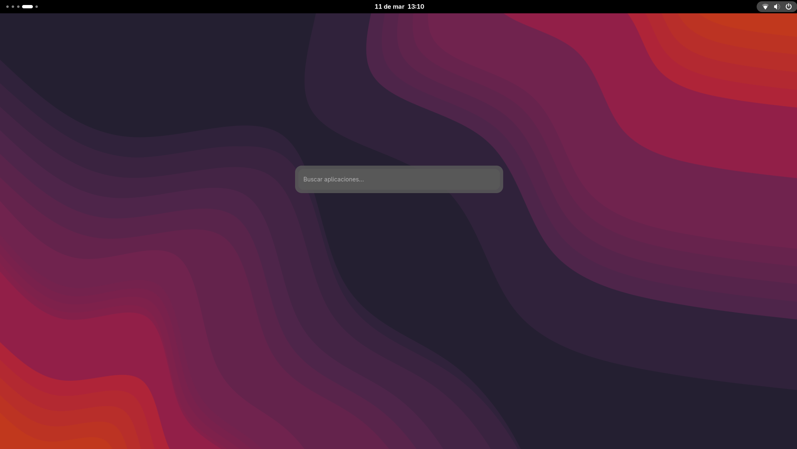
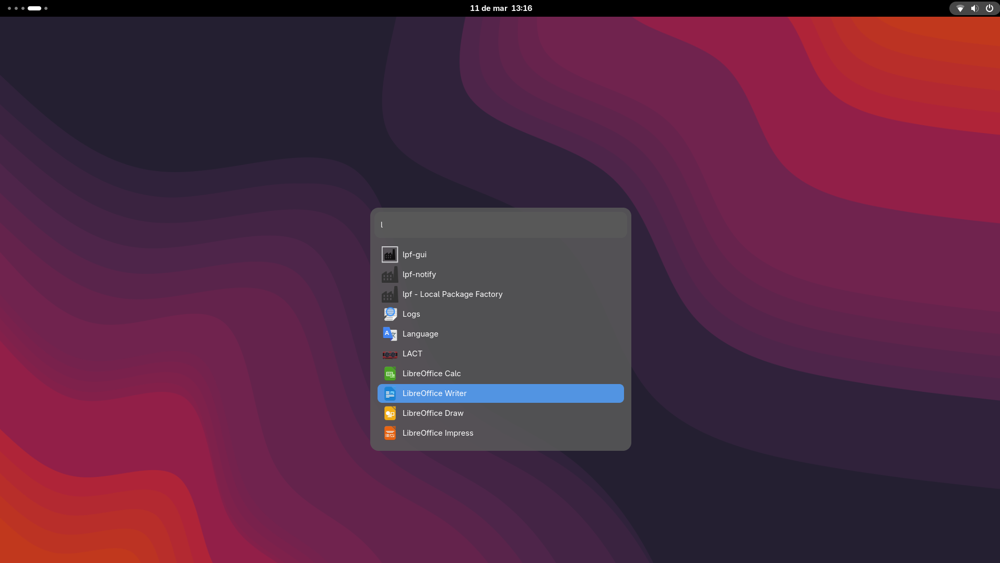

# rspot

A fast, minimal application launcher for Linux — inspired by macOS Spotlight. Built with Rust and GTK4.





## Features

- **Fuzzy search** — find apps instantly with partial matches
- **App icons** — resolves icons from your system theme
- **Keyboard navigation** — arrows to move, Enter to launch, Escape to hide
- **Mouse support** — click to launch
- **Global hotkey** — summon from anywhere via D-Bus
- **Runs in background** — instant response, always ready
- **Auto-detects new apps** — watches `.desktop` file directories for changes
- **Fully themeable** — colors and fonts via `~/.config/rspot/config.toml`
- **GNOME/Wayland native** — built with GTK4

## Installation

### Dependencies

```bash
sudo dnf install gtk4-devel libadwaita-devel
```

### Build & Install

```bash
git clone https://github.com/yourusername/rspot
cd rspot
./install.sh
```

The installer will:

1. Compile the release binary
2. Install it to `/usr/local/bin`
3. Set up autostart on login
4. Register `Super+R` as the global hotkey
5. Create a default config at `~/.config/rspot/config.toml`
6. Launch rspot in the background

## Usage

| Key       | Action              |
| --------- | ------------------- |
| `Super+R` | Open launcher       |
| `↑` `↓`   | Navigate results    |
| `Enter`   | Launch selected app |
| `Escape`  | Hide launcher       |
| Click     | Launch app          |

## Configuration

Edit `~/.config/rspot/config.toml`:

```toml
[window]
width = 500
max_height = 580

[colors]
background = "rgba(90, 90, 90, 0.85)"
opacity = 1
selected_item_color = "#5294e2"

[font]
font_size = 14
font_color = "#ffffff"

```

Restart rspot after changing the config:

```bash
pkill rspot && nohup /usr/local/bin/rspot &>/dev/null &
```

## How it works

rspot reads `.desktop` files from:

- `/usr/share/applications` — system apps
- `~/.local/share/flatpak/exports/share/applications` — Flatpak apps

It runs as a background process and exposes a D-Bus interface at `com.davidgl.Rspot`. The global hotkey calls `Show()` via D-Bus to bring up the window.

## Built with

- [Rust](https://www.rust-lang.org/)
- [GTK4](https://gtk-rs.org/)
- [fuzzy-matcher](https://github.com/lotabout/fuzzy-matcher)
- [zbus](https://gitlab.freedesktop.org/dbus/zbus)
- [notify](https://github.com/notify-rs/notify)
- [serde](https://serde.rs/) + [toml](https://github.com/toml-rs/toml)
